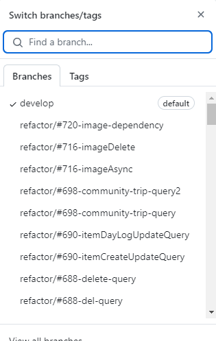

# 컨벤션

---

# Git & Gitlab 규칙

- 예시 (임시)
    
    ## **| Issue Rule**
    
    1. label 설정
        
        개발 파트 label과 이슈 종류 label을 함께 사용했다. 
        
        - 개발 파트
            - Backend
            - Frontend-Admin
            - Frontend-DesignSystem
            - Frontend-Service
        - 이슈 종류
            - Feature : 새로운 기능 또는 명세가 추가된 경우
            - Bug
            - Environment : 추가 환경설정이 필요한 경우 사용하는 이슈
            - Refactor
            - Suggestion : 팀원들과 논의할 내용이 있을 때 사용하는 이슈
    2. 제목 : 이슈의 내용이 명확하게 드러나도록 작성
    3. 내용, 템플릿
        - `bug` : 버그에 대한 설명
            - 템플릿
                
                ```markdown
                name: "\U0001F41E Bug"
                description: "버그가 발생했나요?"
                labels: "\U0001F41E Bug"
                body:
                  - type: textarea
                    attributes:
                      label: 🐞 버그 설명
                      description: 버그에 대한 설명을 작성해 주세요.
                    validations:
                      required: true
                  - type: textarea
                    attributes:
                      label: ✅ 예상 결과
                      description: 예상한 결과를 작성해 주세요.
                    validations:
                      required: true
                  - type: textarea
                    attributes:
                      label: ❗ 실제 결과
                      description: 실제 결과를 작성해 주세요.
                    validations:
                      required: true
                  - type: textarea
                    attributes:
                      label: 💻 버그 시뮬레이션
                      description: 버그를 발견하게 된 상황을 단계별로 적어주세요.
                    validations:
                      required: true
                  - type: textarea
                    attributes:
                      label: 📄 로그
                      description: 로그가 있으면 복붙해 주세요.
                      render: shell
                    validations:
                      required: false
                  - type: textarea
                    attributes:
                      label: 🌏 환경
                      description: 버그가 발생한 환경에 대해 작성해 주세요.
                      placeholder: |
                        OS: macOS 12.2.1
                    validations:
                      required: false
                  - type: textarea
                    attributes:
                      label: 🙋🏻 More
                      description: 더 하고 싶은 말이 있다면 작성해 주세요.
                ```
                
            - 원래 예상했던 결과, 실제로 나타난 결과
            - 버그를 발견하게된 단계별 상황
            - 로그기록
            - 버그 발생 환경
            - 추가 내용
        - `environment` : 추가 환경설정이 필요한 경우
            - 템플릿
                
                ```markdown
                name: "\U0001F30F Environment"
                description: "추가적인 환경설정이 필요한가요?"
                labels: "\U0001F30F Environment"
                body:
                  - type: textarea
                    attributes:
                      label: 🤔 Describe
                      description: 현재 어떤 상황인지 설명해 주세요.
                      placeholder: 자세히 적을수록 좋습니다!
                    validations:
                      required: true
                  - type: textarea
                    attributes:
                      label: ✅ Tasks
                      description: 추가할 환경 설정에 대해 간략히 기록해 주세요.
                      placeholder: 최대한 세분화 해서 적어주세요!
                    validations:
                      required: true
                  - type: textarea
                    attributes:
                      label: 🙋🏻 More
                      description: 더 하고 싶은 말이 있다면 작성해 주세요.
                ```
                
            - 현재 추가 환경 설정이 필요하게 된 배경 설명
            - 추가할 환경 설정에 대한 설명
            - 추가 내용
        - `feature` : 새로운 기능
            - 템플릿
                
                ```markdown
                name: "✨ Feature"
                description: "새로운 기능 또는 명세가 있나요?"
                labels: "✨ Feature"
                body:
                  - type: textarea
                    attributes:
                      label: 📄 Describe
                      description: 새로운 기능에 대한 설명을 작성해 주세요.
                      placeholder: 자세히 적을수록 좋습니다!
                    validations:
                      required: true
                  - type: textarea
                    attributes:
                      label: ✅ Tasks
                      description: 해야 하는 일에 대한 Tasks를 작성해 주세요.
                      placeholder: 최대한 세분화 해서 적어주세요!
                    validations:
                      required: true
                  - type: textarea
                    attributes:
                      label: 🙋🏻 More
                      description: 더 하고 싶은 말이 있다면 작성해 주세요.
                ```
                
            - 새로운 기능을 구현하기 위해 필요한 TASK 상세 설명
            - 추가 내용
        - `refactor` : 리펙토링
            - 템플릿
                
                ```markdown
                name: "\U0001F528 Refactor"
                description: "리팩터링을 해야할 부분이 있나요?"
                labels: "\U0001F528 Refactor"
                body:
                  - type: textarea
                    attributes:
                      label: 🔨 Describe
                      description: 왜 리팩터링을 해야하는지 설명해주세요!
                      placeholder: 자세히 적을수록 좋습니다!
                    validations:
                      required: true
                  - type: textarea
                    attributes:
                      label: ✅ Tasks
                      description: 리팩터링을 할 부분에 대해서 자세히 작성해 주세요.
                      placeholder: 최대한 세분화 해서 적어주세요!
                    validations:
                      required: true
                  - type: textarea
                    attributes:
                      label: 🙋🏻 More
                      description: 더 하고 싶은 말이 있다면 작성해 주세요.
                ```
                
            - 리팩토링 해야하는 이유
            - 리팩토링 해야하는 부분에 대한 설명
            - 추가 내용
        - `suggestion` : 회의 주제, 고찰점, 제안
            - 템플릿
                
                ```markdown
                
                ```
                
            - 추가 내용
    
    ```markdown
    Issue Template Example)
    
    labels : feature
    제목 : 소셜 로그인 인증 구현
    내용 :
    ## :memo: Describe
    구글 및 카카오 OAuth id 토큰을 통해 인증 구현
    
    ## :white_check_mark: Tasks
    - [ ] 구글 소셜 로그인 api
    - [ ] 카카오 소셜 로그인 api
    
    ## :?: More
    refreshToken은 쿠키로 저장하도록 클라이언트에게 보냈다.
    ```
    
    - 참고
        
        [에러 추적 개선을 위한 Sentry 환경 구축 by dladncks1217 · Pull Request #770 · woowacourse-teams/2023-hang-log](https://github.com/woowacourse-teams/2023-hang-log/pull/770)
        
    

[Today I Learn commit 방식](https://www.notion.so/Today-I-Learn-commit-a1e288cbc099420fa97ef6138a3de0a7?pvs=21)

[Reference issues in your development work | Jira Cloud | Atlassian Support](https://support.atlassian.com/jira-software-cloud/docs/reference-issues-in-your-development-work/)

## Commit 룰

- gitmoji 사용
- `커밋종류` + `:` + `간략한 설명` + `jira issue 번호`

```
ex)
feat: 세션 기능 추가 S11P12A401-102

- 자세히 무엇무엇1
- 자세히 무엇무엇2
```

- ✨`feat` : 새로운 기능 추가
- 🐛`fix` : 버그 수정
- ♻️`refactor` : 코드 리펙토링
- 👷`chore` : 빌드 업무 수정, 패키지 매니저 수정
- 📝`docs` : 문서 수정
- ✅`test` : 테스트 코드, 리펙토링 테스트 코드 추가

| 아이콘 | 코드 | 설명 | 원문 |
| --- | --- | --- | --- |
| 🎨 | :art: | 코드의 구조/형태 개선 | Improve structure / format of the code. |
| ⚡️ | :zap: | 성능 개선 | Improve performance. |
| 🔥 | :fire: | 코드/파일 삭제 | Remove code or files. |
| 🐛 | :bug: | 버그 수정 | Fix a bug. |
| 🚑 | :ambulance: | 긴급 수정 | Critical hotfix. |
| ✨ | :sparkles: | 새 기능 | Introduce new features. |
| 📝 | :memo: | 문서 추가/수정 | Add or update documentation. |
| 💄 | :lipstick: | UI/스타일 파일 추가/수정 | Add or update the UI and style files. |
| 🎉 | :tada: | 프로젝트 시작 | Begin a project. |
| ✅ | :white_check_mark: | 테스트 추가/수정 | Add or update tests. |
| 🔒 | :lock: | 보안 이슈 수정 | Fix security issues. |
| 🔖 | :bookmark: | 릴리즈/버전 태그 | Release / Version tags. |
| 💚 | :green_heart: | CI 빌드 수정 | Fix CI Build. |
| 📌 | :pushpin: | 특정 버전 의존성 고정 | Pin dependencies to specific versions. |
| 👷 | :construction_worker: | CI 빌드 시스템 추가/수정 | Add or update CI build system. |
| 📈 | :chart_with_upwards_trend: | 분석, 추적 코드 추가/수정 | Add or update analytics or track code. |
| ♻️ | :recycle: | 코드 리팩토링 | Refactor code. |
| ➕ | :heavy_plus_sign: | 의존성 추가 | Add a dependency. |
| ➖ | :heavy_minus_sign: | 의존성 제거 | Remove a dependency. |
| 🔧 | :wrench: | 구성 파일 추가/삭제 | Add or update configuration files. |
| 🔨 | :hammer: | 개발 스크립트 추가/수정 | Add or update development scripts. |
| 🌐 | :globe_with_meridians: | 국제화/현지화 | Internationalization and localization. |
| 💩 | :poop: | 똥싼 코드 | Write bad code that needs to be improved. |
| ⏪ | :rewind: | 변경 내용 되돌리기 | Revert changes. |
| 🔀 | :twisted_rightwards_arrows: | 브랜치 합병 | Merge branches. |
| 📦 | :package: | 컴파일된 파일 추가/수정 | Add or update compiled files or packages. |
| 👽 | :alien: | 외부 API 변화로 인한 수정 | Update code due to external API changes. |
| 🚚 | :truck: | 리소스 이동, 이름 변경 | Move or rename resources (e.g.: files paths routes). |
| 📄 | :page_facing_up: | 라이센스 추가/수정 | Add or update license. |
| 💡 | :bulb: | 주석 추가/수정 | Add or update comments in source code. |
| 🍻 | :beers: | 술 취해서 쓴 코드 | Write code drunkenly. |
| 🗃 | :card_file_box: | 데이버베이스 관련 수정 | Perform database related changes. |
| 🔊 | :loud_sound: | 로그 추가/수정 | Add or update logs. |
| 🙈 | :see_no_evil: | .gitignore 추가/수정 | Add or update a .gitignore file. |

## Branch 룰

- `feature`/`refactor`/`fix`/`test` + `-` + `간략한 설명` + `/` + `jira issue 번호`
    - branch는 관련된 issue를 적는다.
    
    ```bash
    ex)
    feature-gitlab-jira/S11P12A401-102
    ```
    
- `기능 branch`  → `develop`→ `main` 브랜치 순으로 merge를 한다.
    - 왜냐하면 main에서는 정말 필요하고 안전한 코드만 있어야 한다.
    - develop 에서 배포 테스트를 진행하고, 테스트 완료된 코드와, 리뷰가 완료된 코드만 main으로 올린다.
- 자주 사용되는 건 develop이기에 default로 설정한다.
- 참고자료
    
    
    

## PR 룰

1. issue 템플릿을 지정한다.
2. 어떤 기능을 구현할 것인지 먼저 issue로 작성한다.
3. PR을 날릴때, `마지막에 space를 넣고, #{issue_number}` 를 추가하여 어떤 issue 에 대한 pr인지 설정한다.
4. issue를 완전히 close 하려면, `close #{issue_number}` 를 추가한다.
- Label
    1. ✨ Feature
        - 기능이 추가 되었을 때
    2. 🐞 Bug
        - 버그를 고칠 때
    3. 🔨 Refactor
        - 구조를 바꾸거나 이름을 바꿀때
    4. 🌏 Environment
        - 서버 설정 및 초기 세팅 시

```markdown
PR Template Example)

## 📄 Summary
- 어떤 부분을 수정/추가했는지 작성해 주세요

<br>

## 🙋🏻 To Reviewers
- 리뷰어가 주의 깊게 볼 필요가 있는 부분을 작성해 주세요

```

- 참고
    
    [[Project] Github PR->merge 시 issue 자동 close 방법](https://yeoonjae.tistory.com/entry/Project-Github-PR-merge-시-issue-자동-close-방법)
    

---

# 협업 규칙

## Jira 룰

- 월요일 10시 10분에 회의를 통해 주간 업무를 설정합니다.
- 일주일에 최소 40시간(8시간 x 5일)은 프로젝트를 위한 시간으로 알차게 활용하도록 합니다.

### Scrum 형식

- 매일 10시에 서서 일일 스크럼을 진행합니다.
- 전날 방과후에 수행한 일정, 오늘 오전, 오후 예정에 대해 간략하게 이야기합니다.
- 참여자의 발언 이후 박수를 칩니다.
- 지시를 하거나 깊은 논의를 하지 않도록 주의합니다.
- 예시 양식
    
    ## 🌞 Morning Scrum (10:00)
    
    ### 1. 전날의 기록
    
    - 전체:
    - Backend:
    - Frontend:
    
    ### 2. 오늘의 전체 목표
    
    - 전체:
    - Backend:
    - Frontend:
    
    ### 3. 개인 목표
    
    **1) 팀장: 오화랑**
    
    - [ ]  
    - [ ]  
    
    **2) 팀원: 김윤홍**
    
    - [ ]  
    - [ ]  
    
    **3) 팀원: 변재호**
    
    - [ ]  
    - [ ]  
    
    **4) 팀원: 김경호**
    
    - [ ]  
    - [ ]  
    
    **5) 팀원: 이규석**
    
    - [ ]  
    - [ ]  
    
    **6) 팀원: 송인범**
    
    - [ ]  
    - [ ]  
    
    ## 🌜 Evening Scrum (17:20)
    
    ### 1. 전체 진행 상황
    
    - 전체:
    - Backend:
    - Frontend:
    
    ### 2. 개인 진행 상황
    
    **1) 팀장: 오화랑**
    
    - [ ]  
    
    **2) 팀원: 김윤홍**
    
    - [ ]  
    
    **3) 팀원: 변재호**
    
    - [ ]  
    
    **4) 팀원: 김경호**
    
    - [ ]  
    
    **5) 팀원: 이규석**
    
    - [ ]  
    
    **6) 팀원: 송인범**
    
    - [ ]  
    
    ### 3. 내일 목표
    
    - 전체:
    - Backend:
    - Frontend:
    
    **1) 팀장: 오화랑**
    
    - [ ]  
    
    **2) 팀원: 김윤홍**
    
    - [ ]  
    
    **3) 팀원: 변재호**
    
    - [ ]  
    
    **4) 팀원: 김경호**
    
    - [ ]  
    
    **5) 팀원: 이규석**
    
    - [ ]  
    
    **6) 팀원: 송인범**
    
    - [ ]  
    
    ### 4. Somebody Help me... 😭📢
    
    - 전체:
    - Backend:
    - Frontend:

[아키텍쳐 설계](https://www.notion.so/8e8ce5e5d9b44d239db3176be4af9e82?pvs=21)