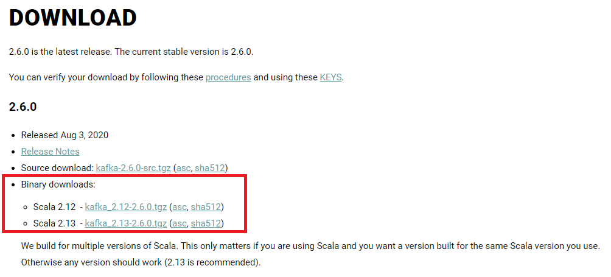

# Kafka 키는 법

생성일: 2024년 7월 24일 오후 8:23
태그: 가이드
담당자: JB
작성자: JB

# Kafka 설치 및 실행하기

### 설치

- [공식 홈페이지에서 다운로드 받기](https://kafka.apache.org/downloads)
    - 여러 다운로드 가능한 파일들 중에서, 꼭 'Binary 파일'로 받을 것!
    - ex) Scala 2.12 or Scala 2.13
    
    
    

### 실행

- zookeeper 와 kafka 실행
    - **설치된 디렉토리로 이동하여**, zookeeper 와 kafka 를 각각 별개의 터미널에서 실행한다.
    
    ```bash
    # kafka 가 설치된 폴더 위치로 이동한다. 
    # 반드시 zookeeper -> kafka 순으로 실행할 것!
    
    # 1. zookeeper 실행
    -# 안되면 git bash에서
    > bin/zookeeper-server-start.sh [-daemon] config/zookeeper.properties
    
    # 2. kafka 실행
    > bin\windows\kafka-server-start.bat [-daemon] config\server.properties
    # 안되면 git bash에서
    > bin/kafka-server-start.sh [-daemon] config/server.properties
    
    # -d or -deamon 는 백그라운드로 실행한다는 뜻 (생략가능)
    
    # 확인하는 법
    netstat -na | findstr "2181"     # zookeeper 확인
    netstat -na | findstr "9092"     # kafka 확인
    ```